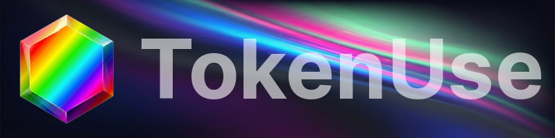
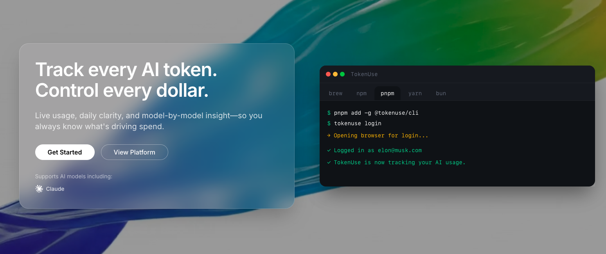

<p align="center">
  
</p>

<h1 align="center">TokenUse</h1>

<p align="center">
  Unified LLM usage + cost tracking across providers.
</p>

<p align="center">
  
  
  
  
</p>

<p align="center">
  
</p>

---

## What TokenUse answers

- What did we spend today
- Which project is driving cost
- Which models are trending up
- Where are the spikes coming from
- What changed since yesterday

## What it is

**A CLI-first usage tracker** with an **optional dashboard** for LLM APIs.  
Built for complete coverage without slowing developers down.

TokenUse takes the best parts of modern observability tools:
- lightweight instrumentation
- centralized normalization
- a cost story that’s obvious in seconds

---

## What you get

- **Daily view:** tokens, requests, latency, cost
- **Attribution:** by project, environment, model, key
- **Budgets:** soft alerts + hard stops (optional)
- **Exports:** CSV / JSON for reporting
- **Comparable metrics:** one schema across providers

---

## Providers (direction)

- Anthropic
- OpenAI (Coming Soon)
- Gemini (Coming soon)

---

## How it works

```text
1) Configure keys + project mapping
2) Collect usage events
3) Normalize tokens + cost across providers
4) Query locally (CLI) or publish to the dashboard
